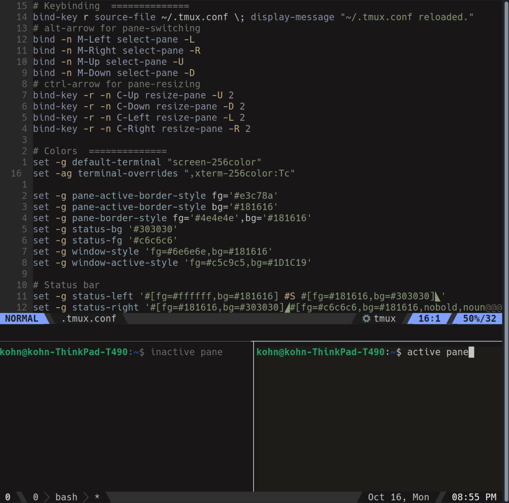

# .tmux.config



### OPTIONAL: DMUX SCRIPT
The dmux file is included in the repository.  All it does is creates a new window with three panes upon execution.  The user can specify the orientation and/or session name if they want.

My systems run off linux, so keep in mind to use the correct windows/mac path structures.
It should be placed in the .local/bin/ directory, but if placed in a different directory then update the first line to the correct path.

Recommended steps to use the script:
1. Place in .local/bin/
2. cd into where the file is inserted: e.g. ```cd .local/bin/```
3. ```chmod +x dmux``` OR ensure execution permissions is allowed in it's properties.
4. Run script in various ways:
```$ dmux```, ```$ dmux h new-session```, ```$ dmux new-session```, ```$ dmux new-session h```, ```$ dmux h```
